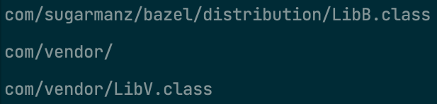
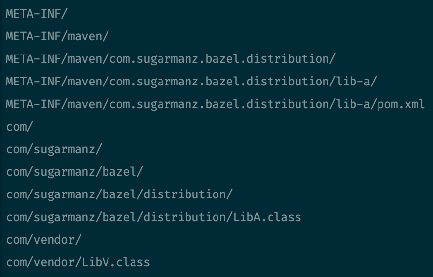
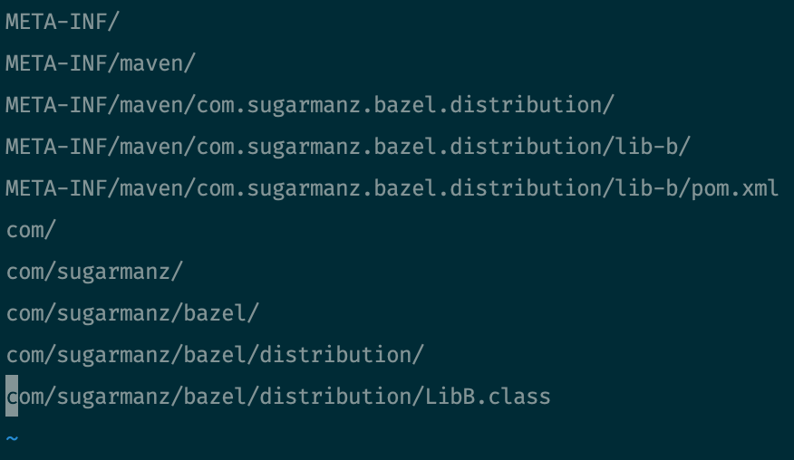
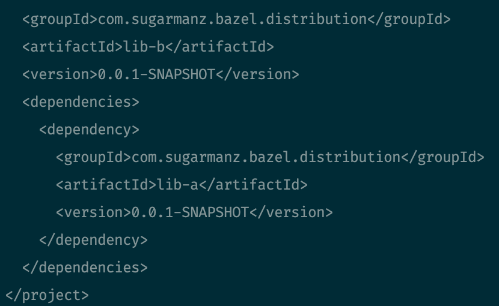

# JVM Bazel Distribution w/ local vendor JARs

Attempting to use [vaticle/bazel-distribution](https://github.com/vaticle/bazel-distribution) for publishing rules.

### Problem Statement

I would like to publish a JVM library to a Maven repository that includes a local vendor JAR that doesn't _necessarily_ exist on a Maven repository to be included transitively.

### Issues

1. On `master`, error when aggregating `compilation_outputs` as part of `assemble_maven` rule:

```
ERROR: /Users/jzucker/dev/GitHub/sugarmanz/bazel-distribution-local-jars/vendor/BUILD:1:12: in @vaticle_bazel_distribution//maven:rules.bzl%aggregate_dependency_info aspect on java_import rule //vendor:vendor: 
Traceback (most recent call last):
        File "/private/var/tmp/_bazel_jzucker/79455980711f6ad435ad72790d6cbd9f/external/vaticle_bazel_distribution/maven/rules.bzl", line 202, column 78, in _aggregate_dependency_info_impl
                class_jar = target[OutputGroupInfo].compilation_outputs.to_list()[0],
Error: index out of range (index is 0, but sequence has 0 elements)
```

2. I added some rigor around the `aggregate_dependency_info` aspect to handle `java_import` rules as part of (#336)[https://github.com/vaticle/bazel-distribution/pull/336], but this introduces another issue. The recursion of the `aggregate_dependency_info` causes the compiled outputs of the `java_import` to be included by _any_ target that includes the `java_import` as a dependency, hard or transitive.

i.e. `//lib-b:assemble` would try to bundle the `//vendor` even though it _should_ already be included in `lib-a`.



I solved this by filtering out JAR transitive dependencies from dependencies that have Maven coordinates because that JAR would have already been bundled into a published dependency.
https://github.com/sugarmanz/bazel-distribution/blob/412162f901f6650e67e014156945ee06c6619b1b/maven/rules.bzl#L224-L229

### Desired Output

- `lib-a.jar` should include `lib-a` classes and `vendor` classes



- `lib-b.jar` should include `lib-b` classes and a dependency on `lib-a`



